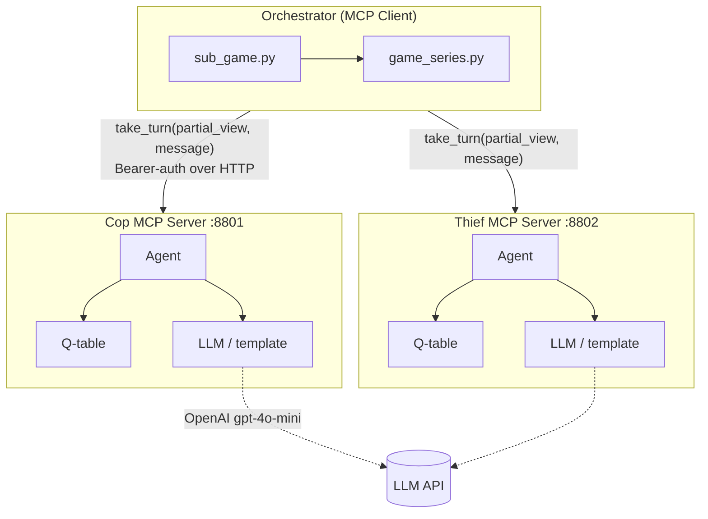
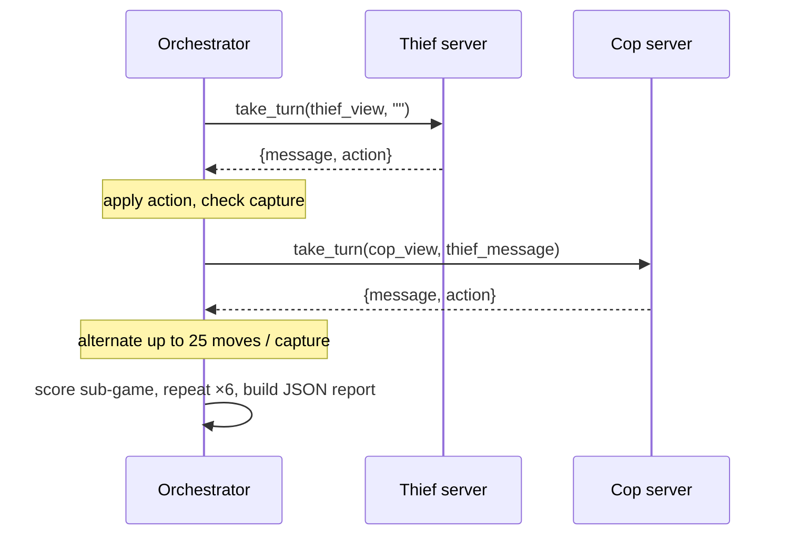

# Cop/Thief — Dual AI Agent Race via MCP Servers

Ex06 (bonus), team code **SMNGRP05** — afaf gharra (ID 208123232).

Two independent AI agents — a **Cop** and a **Thief** — hunt/evade each other
on a grid. Each agent is backed by its own **FastMCP server** and can only
learn about the other through **free natural-language messages**; there is
no shared memory or direct function call between them. See
[`docs/PRD.md`](docs/PRD.md) and [`docs/PLAN.md`](docs/PLAN.md) for the full
design, and [`docs/PRD_mcp_protocol.md`](docs/PRD_mcp_protocol.md) /
[`docs/PRD_q_learning.md`](docs/PRD_q_learning.md) for the two core
mechanisms.

## Formal model — Decentralized Partially-Observable MDP (Dec-POMDP)

The pursuit game is a two-agent Dec-POMDP
⟨ *n*, *S*, {*Aᵢ*}, *P*, *R*, {*Ωᵢ*}, *O*, *γ* ⟩:

| Symbol | Meaning | This game |
|--------|---------|-----------|
| *n* | number of agents | **2** (cop, thief) |
| *S* | state space | (cop cell) × (thief cell) × (barrier set) on an *N×N* grid |
| *Aᵢ* | agent *i*'s actions | thief: {up, down, left, right}; cop: same **+ place_barrier** |
| *P* | transition function | deterministic grid moves; a barrier blocks the target cell |
| *R* | reward / scoring | capture → cop +20 / thief +5; survival → cop +5 / thief +10 (config-driven) |
| *Ωᵢ* | agent *i*'s observations | own cell, visible barriers, turn counter, a coarse distance *bucket* — **never the opponent's cell** |
| *O* | observation function | `GameState.partial_view(role)` in `src/copthief/game/state.py` |
| *γ* | discount factor | **0.9** (`config/config.json → q_learning.discount_factor`) |

The partial observability is real and enforced in both the code and the LLM
prompt: an agent must *infer* the opponent's position from their natural-language
message and the distance bucket, because *Ωᵢ* structurally excludes it.

## The orchestration challenge (why this is hard)

The graded difficulty is not "who wins" but coordinating two autonomous agents
over an **unstructured** channel:

- **Ambiguity**: free text has no schema, so each agent must robustly parse an
  open-ended message into an actionable belief. Handled by
  `nl_protocol.parse_reply`, which extracts intent + a validated action and
  falls back safely on anything malformed.
- **Misdirection**: nothing forces honesty — agents routinely bluff
  ("No barriers can hold me down", "Too predictable! I'll find another way!").
  A real exchange from the live run is in [`assets/llm_run_log.txt`](assets/llm_run_log.txt).
- **Mutual understanding without a shared protocol**: the only guarantee of
  progress is that each side re-grounds every turn in its *own* partial
  observation (`partial_view`) plus the message, and that action legality is
  re-validated server-side by `game/rules.py` — never trusted from the peer.

## Architecture





## Installation

Requirements: Python 3.11+, [`uv`](https://docs.astral.sh/uv/).

```bash
uv sync --extra dev
cp .env-example .env   # optional: set ANTHROPIC_API_KEY for live LLM dialogue
```

Common setup issues:
- **No `ANTHROPIC_API_KEY`**: agents automatically fall back to an offline,
  deterministic message template — the game still runs end-to-end.
- **Port already in use**: the standalone server scripts bind
  `127.0.0.1:8801` (cop) and `127.0.0.1:8802` (thief); change
  `COP_MCP_PORT`/`THIEF_MCP_PORT` in `src/copthief/shared/constants.py` if
  those ports are taken.

## Usage

Run a full 6-sub-game series locally (both MCP servers are started
in-process, no ports needed for this default mode):

```bash
uv run python -m copthief.main
```

This prints an ASCII transcript of each sub-game, the final cop/thief
totals, and writes `results/game_report.json` (schema in
`docs/PRD.md` §JSON report) plus `results/final_positions.png`.

To draft (but **not send**) the submission email from that report:

```bash
uv run python -m copthief.reporting.draft_email
```

This writes `results/draft_email.eml` (a standard, openable email file) with
the report as its body, addressed to `config.json: report_recipient` — no
Gmail API call is made. Review it, then send it yourself once
`GMAIL_CREDENTIALS_PATH` is configured (see
`docs/PRD_gmail_reporting.md`) via `GmailSender.send_report(...)`.

To run the two agents as genuinely separate HTTP processes (the
"two localhost servers on different ports" deployment stage from the
exercise spec), in two terminals:

```bash
uv run python -m copthief.mcp_servers.cop_server
uv run python -m copthief.mcp_servers.thief_server
```

Workflows / flags:
- `OPENAI_API_KEY` set → agents converse in live `gpt-4o-mini` free text
  (`ANTHROPIC_API_KEY` also supported; OpenAI wins if both are set).
- neither set → offline template fallback (used for all automated tests/CI).
- `config/config.json` → grid size, move limit, number of sub-games, barrier
  limit, the scoring table, and Q-learning hyper-parameters (see `docs/PLAN.md`).
- `--cop-url/--thief-url [--auth-token]` → drive already-running remote servers
  (localhost-on-ports or the AWS cloud deployment) instead of in-process.

## Research & analysis

[`notebooks/results_analysis.ipynb`](notebooks/results_analysis.ipynb) (committed
**with executed outputs**) is a systematic parameter study: a learning curve, an
epsilon exploration sweep, a grid-size sweep, seed-variance, and the live-LLM
cost breakdown. Figures: [learning curve](assets/learning_curve.png),
[epsilon sweep](assets/epsilon_sweep.png), [grid sweep](assets/grid_sweep.png),
[seed variance](assets/seed_variance.png).

**LLM cost** (measured on the real `gpt-4o-mini` run, `assets/demo_llm_usage.json`):

| Metric | Value |
|--------|-------|
| Calls (one per agent turn) | 73 per 6-game series |
| Prompt / output tokens | 15,843 / 5,740 |
| Cost per full 6-game series | **$0.0058** |
| Projected cost of 100 series | ~$0.58 |

## Examples and demos

**Live LLM dialogue** (real excerpt from [`assets/llm_run_log.txt`](assets/llm_run_log.txt),
`gpt-4o-mini`):

```
[cop]  I will not go 'up' as the optimizer suggests, since their last message
       implies they could be moving in an unexpected horizontal direction.
       Instead, I'll move 'right' to cover more ground and potentially intercept.
       "I'm guessing your tactic involves sneaking away horizontally..."
[thief] Your last move suggests you're avoiding me and may have gone horizontally.
       You could be in row 2 now... I'll shift left to cover potential escape routes.
       "I'm one step ahead!"
```

The offline fallback produces the same JSON contract with templated text, so the
pipeline runs end-to-end with no API key.

`results/final_positions.png` plots each sub-game's final cop (blue square)
and thief (red circle) position on the grid.

**Real-time GUI**: `uv run python -m copthief.main` also renders one
animated GIF per sub-game (`results/sub_game_<n>.gif`) via
`src/copthief/gui/animation.py`, showing the cop (blue square), thief (red
circle), and every barrier (black X) turn-by-turn as the game unfolds. A
committed sample is at [`assets/demo_sub_game.gif`](assets/demo_sub_game.gif)
(and [`assets/demo_game_report.json`](assets/demo_game_report.json) is the
matching report) so graders can see a full playback without running the
code. On a machine with a display, `copthief.gui.animation.render_live_window(...)`
additionally opens an interactive matplotlib window instead of saving a file.

## Configuration guide

See `config/config.json` (`grid_size`, `max_moves`, `num_games`,
`max_barriers`, `scoring.*`) and `config/rate_limits.json`
(`requests_per_minute`, `requests_per_hour`, `concurrent_max`,
`retry_after_seconds`, `max_retries` per service: `default`, `llm`, `gmail`).
No gameplay or rate-limit values are hardcoded in source — see
`src/copthief/shared/config.py`.

## Contribution guidelines

Follow the repo's `ruff` config (`uv run ruff check .`), keep files ≤150
lines, write/extend tests before changing behavior (TDD), and update
`docs/TODO.md` as tasks progress. No secrets in source — use `.env`
(git-ignored) with `.env-example` documenting the required keys.

## Credits and license

MIT license (see `pyproject.toml`). Built with
[FastMCP](https://gofastmcp.com), [Anthropic Claude](https://www.anthropic.com),
NumPy, and Matplotlib. Course: bonus exercise ex06, Dr. Yoram Segal.

## Cloud deployment (executed on AWS)

Both MCP servers were deployed for real on an AWS EC2 `t3.micro` (Amazon Linux
2023, `eu-north-1`): a user-data script installs `git` + `uv`, clones this
public repo, and launches the cop server on `0.0.0.0:8801` and the thief on
`0.0.0.0:8802`, each guarded by a `MCP_AUTH_TOKEN` **Bearer token**. The
security group is the "firewall": inbound is restricted to TCP 8801–8802 only;
everything else is closed, and the LLM key was **never** uploaded (cloud
servers run in offline-fallback mode by design — see ADR-5 in `docs/PLAN.md`).
A full 6-game series was then played from the local orchestrator over the
public internet via
`python -m copthief.main --cop-url http://<ip>:8801/mcp --thief-url http://<ip>:8802/mcp`.
Evidence: [`assets/cloud_run_log.txt`](assets/cloud_run_log.txt) (the game
transcript over public URLs), [`assets/cloud_auth_proof.txt`](assets/cloud_auth_proof.txt)
(a `curl` showing HTTP 401 without the token), and
[`assets/demo_cloud_game_report.json`](assets/demo_cloud_game_report.json). All
resources were **torn down in the same session** (instance terminated, security
group deleted) — see the deployment record in `docs/PLAN.md`.

## Known limitations (honest self-assessment)

- **Inter-group bonus race** (§12 of the exercise) needs a second team's
  MCP URLs, which don't exist for a solo submission; the JSON schema and
  builder are implemented (`build_bonus_game_report`, `report_type:
  "bonus_game"`) and unit-tested, but no real cross-group match was played.
- **Q-learning ceiling**: because the state deliberately excludes the
  opponent's cell (true partial observability), the tabular Q-table learns
  positional priors rather than direct pursuit tactics — the cop's win rate
  improves modestly but plateaus (quantified in the learning-curve figure).
  This is a faithful consequence of the Dec-POMDP model, not a bug.
